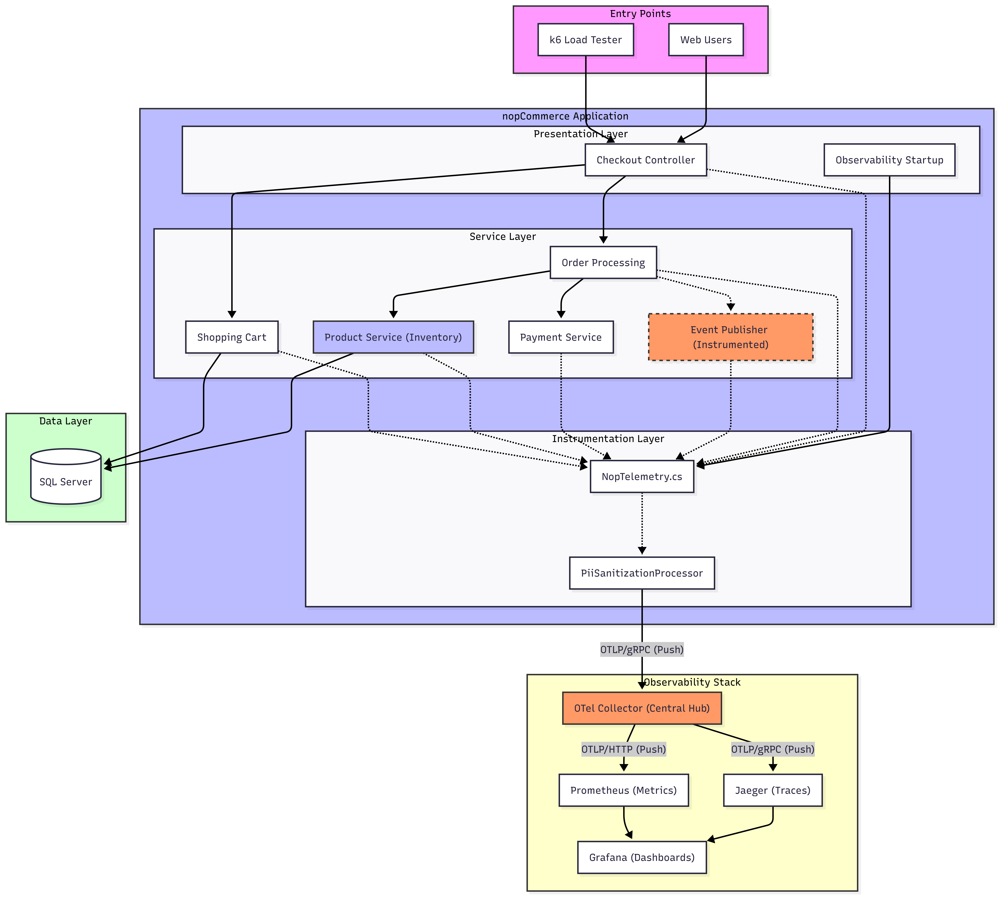
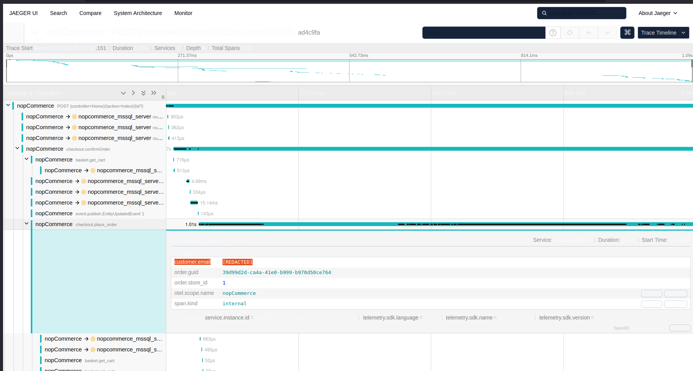
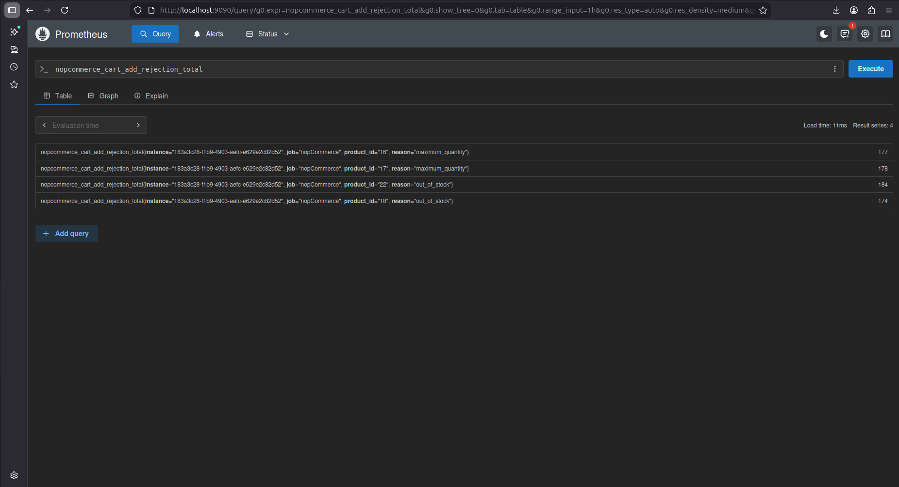
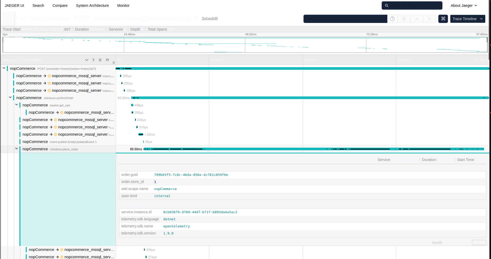
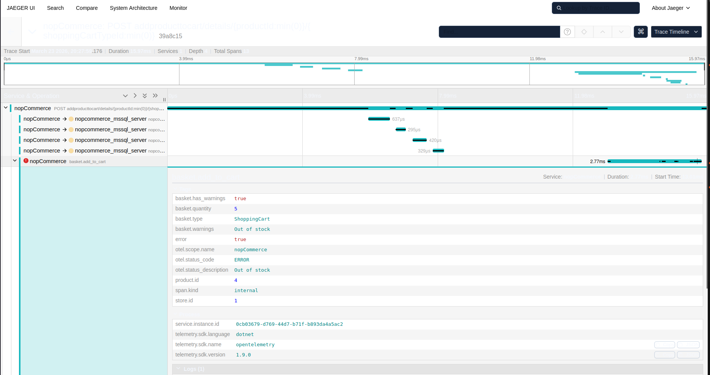
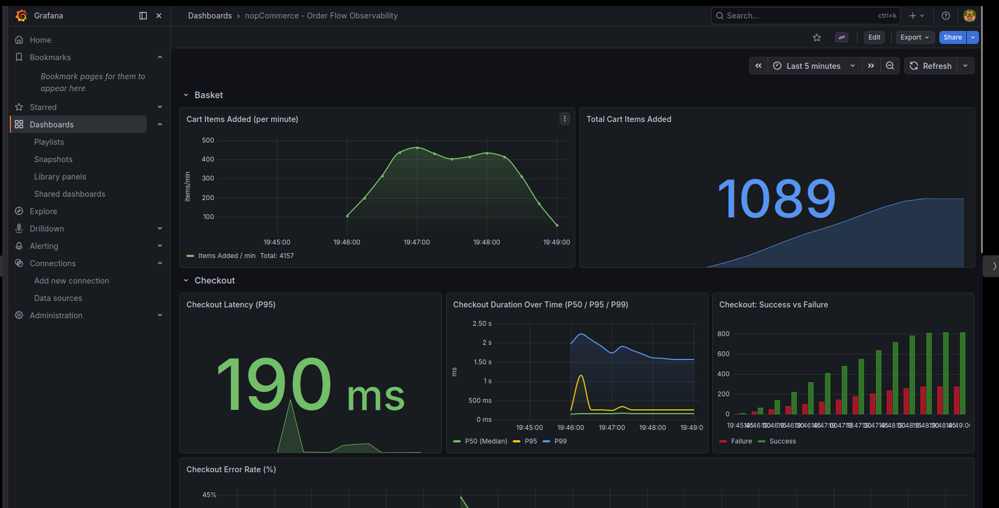
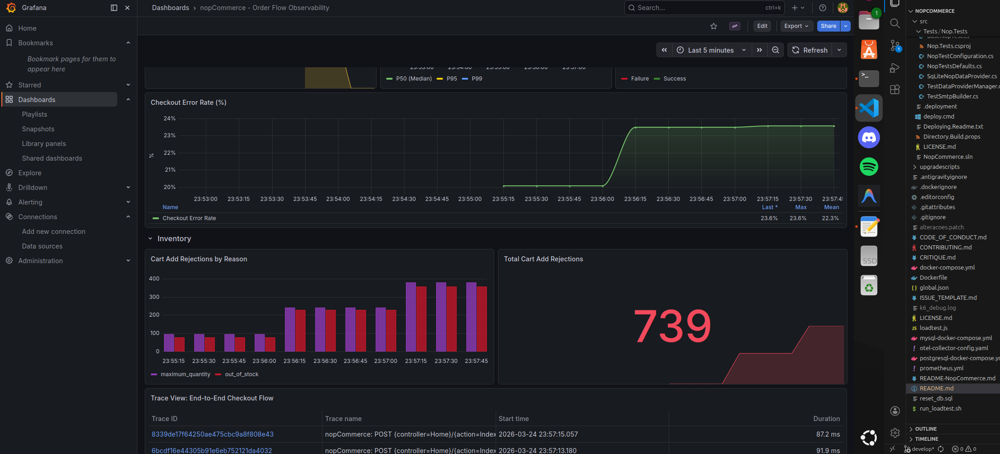
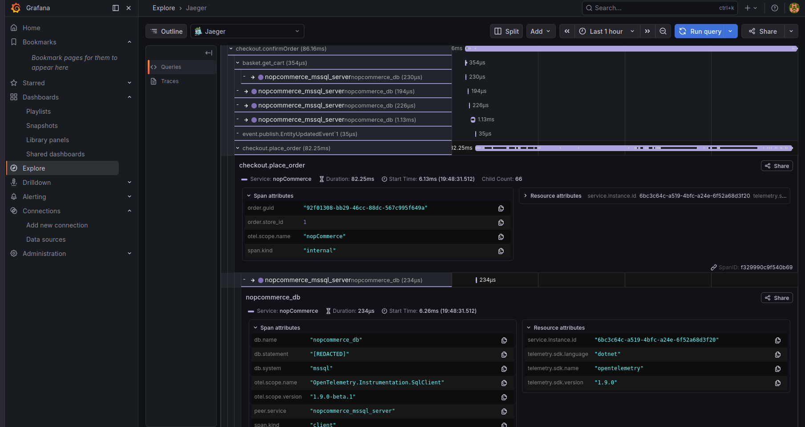

## Observability: Instrumenting the "Customer Places an Order" Flow

This section documents the end-to-end observability instrumentation added to nopCommerce for the **"Customer places an order"** flow.

---

### Architecture Diagram
The observability instrumentation is integrated into nopCommerce using a **layered, in-process architecture** combined with a **centralized telemetry pipeline**. This ensures that telemetry is captured at every stage of the "Customer Places an Order" flow while maintaining strict data privacy and decoupling the application from the storage backends.



### 1. Presentation Layer (Nop.Web)

The entry point of the application.

* **Checkout Controller:** Handles requests from **Web Users** and the **k6 Load Tester**.
* **Observability Startup:** Uses the `INopStartup` interface to configure the OpenTelemetry SDK. It points the OTLP exporter to the **OTel Collector** instead of individual backends, keeping the application's configuration clean and unified.

### 2. Service Layer (Nop.Services)

This is where surgical instrumentation occurs:

* **Shopping Cart (Basket) & Order Processing:** Capture business-level metrics and traces for the checkout funnel.
* **SQL Server:** Database interactions are automatically captured as spans via `SqlClient` instrumentation.

### 3. Instrumentation Layer (In-Process)

This layer operates entirely **within the nopCommerce process**, ensuring data is "clean" before it travels:

* **NopTelemetry.cs:** Manages `ActivitySource` and `Meter`.
* **PiiSanitizationProcessor:** A custom SDK-level filter. Because it runs **in-process**, it redacts sensitive customer data (Emails, Names) **before** the telemetry leaves the application. This ensures that no PII is ever transmitted over the network to the Collector or the backends.

### 4. Observability Stack (Full Push Model)

The infrastructure has been evolved to a **Unified Telemetry Pipeline** using a **Full Push** model, which is the modern standard for OpenTelemetry:

* **OpenTelemetry Collector (Central Hub):** Acts as a high-performance intermediary. It receives traces and metrics via **OTLP/gRPC** on port **4317**, processes them in batches to reduce overhead, and routes them to the appropriate backends.
* **Jaeger (Tracing - PUSH):** Receives traces pushed by the Collector via **OTLP/gRPC**. This decouples the application from trace storage management.
* **Prometheus (Metrics - PUSH):** Unlike the traditional pull model, Prometheus now uses its **OTLP HTTP Receiver** (Port 9090). The Collector **pushes** metrics directly to Prometheus, eliminating the need for periodic scraping and simplifying the network configuration.
* **Grafana:** The visualization layer that queries both Prometheus and Jaeger to provide real-time dashboards.


### Custom Metrics

| Metric | Type | Emitted From | Purpose |
|---|---|---|---|
| `nopcommerce.checkout.duration_ms` | Histogram | `OrderProcessingService.PlaceOrderAsync` | Checkout pipeline latency (P50, P95, P99) |
| `nopcommerce.checkout.completed` | Counter | `PlaceOrderAsync` + `OpcConfirmOrder` | Success/failure count with `failure.stage` tag |
| `nopcommerce.cart.item_added` | Counter | `ShoppingCartService.AddToCartAsync` | Items added to cart, tagged by product |
| `nopcommerce.cart.add_rejection` | Counter | `ShoppingCartService` (two sites) | Stock blocks with `reason`: `out_of_stock`, `quantity_exceeded`, `maximum_quantity` |

### Advanced Instrumentation

| Component | Logic | Impact |
|---|---|---|
| **`EventPublisher`** | Wrap `PublishAsync` with `Activity` | Auto-discovers all internal events (email, stock, etc.) in Jaeger traces. |

---

### How to Build, Run, and View the Dashboard

#### Prerequisites

| Tool | Version | Purpose |
|---|---|---|
| Docker + Docker Compose | 20.10+ | Run all services |
| .NET SDK | 9.0 | Build nopCommerce (handled by Dockerfile) |
| k6 | Latest | Load testing |


#### 1. Start the Full Stack

```bash
docker compose up --build -d
```

This starts **6 containers** in a unified telemetry pipeline:

| Container                  | Port     | Description                                                          |
| -------------------------- | -------- | -------------------------------------------------------------------- |
| `nopcommerce`              | `:80`    | nopCommerce web app. Exports OTLP data to the Collector.             |
| `nopcommerce_mssql_server` | `:1433`  | SQL Server 2019 Express.                                             |
| `otel_collector`           | `:4317`  | Central Hub. Receives OTLP (gRPC) and fans out to Jaeger/Prometheus. |
| `jaeger_container`         | `:16686` | Distributed tracing UI. Receives traces via OTLP from the Collector. |
| `prometheus_container`     | `:9090`  | Time-series database. Receives metrics via OTLP HTTP Push.           |
| `grafana_container`        | `:3000`  | Dashboards (auto-provisioned with Prometheus + Jaeger).              |

#### 2. Initial Setup

1. **Wait for Services:** Ensure all containers are healthy (`docker ps`).
2. **nopCommerce:** Open `http://localhost` and complete the installation wizard.
3. **Generate Data:** Run the **k6 load test** (see Section 3) to populate the pipeline.
4. **Grafana:** Access `http://localhost:3000`. Dashboards are auto-provisioned to read from the unified OTel pipeline.


### 3. Run the Load Test

The load test script (`loadtest.js`) uses **k6** to simulate real users navigating the store. It does not just hit an endpoint; it simulates a full conversion funnel with controlled chaos.

```bash
# Reset inventory state + run k6
./run_loadtest.sh
```

**What exactly does the script do?**

1. **Data Reset (`reset_db.sql`):** Ensures repeatable results by forcing specific database states (e.g., setting stock to zero for specific products to ensure error metrics trigger correctly).
2. **Dynamic Identities:** Generates random names and emails for each virtual user (`buildFakeIdentity`), ensuring the system processes unique orders.
3. **Probabilistic Scenarios:** Traffic is distributed realistically:

   * **60% Success:** Products with available stock (IDs 6, 7).
   * **20% Out of Stock (OOS):** Products forced to zero stock (IDs 18, 22).
   * **20% Max Quantity:** Attempting to buy 5 units of products with a low limit (IDs 16, 17).
4. **Chaos Injection (Forced Failure):** In 25% of checkouts that would otherwise succeed, the script intentionally skips the `OpcSavePaymentInfo` step. This forces a server-side exception during final confirmation to validate that the dashboard captures unexpected technical errors.
5. **Workload Ramp:** Executes a 30s ramp-up to 40 concurrent users, maintains the load for 2m, and ramps down over 30s.

---

### 4. Observability Interfaces

Once the load test is running, you can monitor the telemetry signals via the following links:

* **Grafana (Metrics & Dashboards):** [http://localhost:3000](http://localhost:3000)
* **Jaeger (Distributed Tracing):** [http://localhost:16686](http://localhost:16686)
* **Prometheus (Raw Data):** [http://localhost:9090](http://localhost:9090)


---

### Dashboard Story: The Sales Funnel

The Grafana dashboard tells the operational story of the checkout funnel:

1. **Basket Section** — *"How many items are customers adding?"*
   - **Cart Items Added (per minute)**: Real-time throughput of `AddToCartAsync` — shows customer engagement
   - **Total Cart Items Added**: Cumulative counter — a business-level KPI

2. **Checkout Section** — *"How fast and how reliably are orders being placed?"*
   - **Checkout Latency (P95)**: The 95th percentile of `PlaceOrderAsync` pipeline duration — an SLA metric
   - **Checkout Duration Over Time (P50 / P95 / P99)**: Time series showing latency trends across three percentiles
   - **Checkout Success vs Failure**: Bar chart showing the absolute count of successful vs failed checkout attempts
     - **Note on Business Failures**: While most "Out of Stock" events happen at the basket stage, this panel also captures Late Inventory Rejections. This occurs if a product becomes unavailable after being added to the cart but before the final confirmation. In such cases, the OrderProcessingService rejects the placement, resulting in a red "Failure" bar. This proves the instrumentation monitors both technical exceptions and real-time business blockers during the final commit.
   - **Checkout Error Rate (%)**: A time-series percentage panel calculated as `failed / total × 100`, with threshold colors (green < 5%, orange < 15%, red ≥ 15%)

3. Cart Rejection Section — *"Why are customers unable to add to cart?"*
   - **Cart Add Rejections by Reason**: Stacked bar chart breaking down `out_of_stock` vs `maximum_quantity` vs `quantity_exceeded` — this is the operational insight that tells a stock manager *exactly* what to act on
   - **Cart Add Rejection Rate (per minute)**: Time-series rate showing rejection trends

4. **Traces Section** — *"What does a single checkout look like?"*
   - **Trace View**: Jaeger panel showing full distributed traces.
   - **Automatic Event Discovery**: Thanks to the `EventPublisher` instrumentation, you will see child spans like `event.publish.OrderPlacedEvent`. This allows me to see how many consumers handled the event and if any failed (captured via `AddEvent` in the span).
   
> **The "Observer by Design" Strategy**
> Instead of only instrumenting the controller, I made a **surgical architectural change** to `Nop.Services.Events.EventPublisher`. Since nopCommerce relies on internal events to decouple logic, instrumenting this single point allows the system to automatically generate spans for *any* event published (e.g., `OrderPlacedEvent`). This provides visibility into asynchronous consumer execution and errors without modifying individual business services.

---

### Load Test: Proving the Instrumentation

The k6 script (`loadtest.js`) generates **realistic, controlled chaos** to validate that the telemetry captures real error states:

| Scenario | Probability | Products | Expected Behaviour |
|:--- |:--- |:--- |:--- |
| **Success** | 60% | IDs 6, 7 | Item added → Full checkout completes (Green Bar) |
| **Out of Stock (Initial)** | 20% | IDs 18, 22 | `CartAddRejection(reason=out_of_stock)` at Add-to-Cart stage. |
| **Max Quantity** | 20% | IDs 16, 17 (qty=5) | `CartAddRejection(reason=maximum_quantity)` at Add-to-Cart stage. |
| **Forced Checkout Failure** | 25% of checkouts | Any | Skips `OpcSavePaymentInfo` → Server Exception → **`pre_place_order`** stage (Red Bar). |


This mix ensures the dashboard shows a healthy blend of green (success) and red (failure) in the Checkout Error Rate panel, proving the metrics are not just counters that go up — they capture *meaningful business states*.


---

### PII Security: The Three-Layer Filter

The `PiiSanitizationProcessor` ensures GDPR compliance by filtering every trace span before export:

| Layer | Rule | Example |
|---|---|---|
| **1. System Passthrough** | Tags with `http.`, `db.`, `net.`, `otel.` prefixes are never touched | `http.method=POST` → preserved |
| **2. PII Blacklist** | Tags containing `email`, `phone`, `password`, `card`, `ssn`, `token`, `firstname`, `lastname` → `[REDACTED]` | `customer.email=alice@test.com` → `[REDACTED]` |
| **3. Complex-Object Whitelist** | Tags under `customer.`, `address.`, `billing.`, `shipping.` prefixes: only explicitly allowed suffixes pass through; zip codes are truncated to 4 chars + `**` | `address.zip=12345` → `1234**`; `address.street=...` → `[REDACTED]` |

**Validated by 238-line NUnit test suite** (`PiiSanitizationProcessorTests.cs`) covering all layers, edge cases, and the `db.statement` SQL injection vector.
---

### **Evidence**

The decoupling achieved through DI and `ObservabilityStartup` can be observed directly in the telemetry output. The `EmailRedactedJaeger` screenshot demonstrates that sensitive data such as customer emails has been successfully masked before export, while all relevant tracing information (spans, tags, and events) is still captured in Jaeger. This proves that the telemetry layer operates independently from the business logic and preserves domain integrity.





---

### Dashboard Queries (PromQL & Jaeger)

Here are the exact queries powering the Grafana panels and Jaeger trace views, structured by operational domain.

#### Basket

**Cart Items Added (per minute)**
```promql
sum(rate(nopcommerce_cart_item_added_total[5m])) * 60
```

**Total Cart Items Added**
```promql
sum(nopcommerce_cart_item_added_total)
```

#### Checkout

**Checkout Latency (P95)**
```promql
histogram_quantile(0.95, sum(rate(nopcommerce_checkout_duration_ms_milliseconds_bucket[5m])) by (le))
```

**Checkout Duration Over Time**
* **P50 (Median)**: `histogram_quantile(0.50, sum(rate(nopcommerce_checkout_duration_ms_milliseconds_bucket[5m])) by (le))`
* **P95**: `histogram_quantile(0.95, sum(rate(nopcommerce_checkout_duration_ms_milliseconds_bucket[5m])) by (le))`
* **P99**: `histogram_quantile(0.99, sum(rate(nopcommerce_checkout_duration_ms_milliseconds_bucket[5m])) by (le))`

**Checkout: Success vs Failure**
```promql
sum by (success) (nopcommerce_checkout_completed_total)
```

**Checkout Error Rate (%)**
```promql
100 * (
  sum(nopcommerce_checkout_completed_total{success=~"false|False"})
  /
  clamp_min(sum(nopcommerce_checkout_completed_total), 1)
)
```
*(Note: `clamp_min(..., 1)` avoids division-by-zero errors when no checkouts have occurred).*

#### Inventory

**Cart Add Rejections by Reason**
```promql
sum by (reason) (nopcommerce_cart_add_rejection_total)
```

**Total Cart Add Rejections**
```promql
sum(nopcommerce_cart_add_rejection_total)
```

#### Tracing (Jaeger)

**Trace View: End-to-End Checkout Flow**
```text
Service: nopCommerce
Operation: checkout.place_order
Query Type: search
Limit: 20
```


---

### **Metrics Validation (Prometheus)**

Prometheus acts as the central time-series database, receiving OTLP HTTP streams from the OTel Collector to store the operational data generated by my custom counters and histograms. It no longer relies on a pull-based scraping mechanism; instead, it provides a native OTLP receiver for real-time telemetry ingestion.

* **High-Cardinality Discovery:** The screenshot confirms that the `nopcommerce_cart_add_rejection_total` metric is being correctly ingested with multiple dimensions.
* **Business Context Recovery:** It can be observed that the metric is enriched with specific tags: product_id (e.g., "17", "22") and reason (e.g., maximum_quantity, out_of_stock). This demonstrates that the operational context, which is normally lost in nopCommerce's UI strings, is being successfully preserved for analysis.
* **Granular Visibility:** The table shows exact counts for different rejection scenarios (e.g., 200 rejections for product #22 due to being out of stock), providing the raw data necessary for the Grafana "Inventory" panels.

****


### Tracing Analysis (Jaeger)

Distributed tracing provides a deep dive into how requests flow through nopCommerce, from the initial HTTP call down to individual database queries. This is not just about connectivity; it is about justifying architectural decisions regarding performance and data visibility.

#### **1. Full Success Trace (`checkout.place_order`)**

This trace represents a healthy checkout flow, demonstrating the complex hierarchy of operations required to finalize an order.

* **Span Hierarchy:** A clean transition from `confirmOrder` to the internal `place_order` logic.
* **Database Visibility:** Each SQL command is captured as a child span, showing that a typical checkout involves multiple rapid database interactions, often completing under **300µs** each.
* **Business Metadata:** Custom tags like `order.guid` and `order.store_id` are attached to the span, linking technical telemetry to real business entities for better observability.



---

#### **2. Capturing "Silent" Business Failures (`basket.add_to_cart`)**

This is the practical result of the **Surgical Instrumentation** performed to solve the "Silent Failure" problem where the system hides errors behind simple text strings.

* **The Error Signal:** Although the code did not suffer a technical "crash," the instrumentation manually forced the `otel.status_code` to **ERROR**.
* **Operational Context:** The span explicitly captures the reason for failure via the `otel.status_description` and `basket.warnings` tags (e.g., **"Out of stock"**).
* **Actionable Data:** By including the `product.id` and `basket.quantity`, an operator can immediately identify which specific product is causing friction in the sales funnel without digging through raw logs.




## Grafana Dashboard


The Grafana "Checkout Pipeline Dashboard" during a k6 load test, showing the sales funnel from cart additions through checkout latency to inventory rejections

#### **1. Section: Basket (Sales Funnel)**

* **Cart Items Added (per minute):** Shows the rate at which customers are adding items to their carts.
* **Total Cart Items Added:** A cumulative counter used as a business KPI to measure product interest.


#### **2. Section: Checkout (System Health)**

* **Checkout Latency (P95):** Indicates that 95% of checkout requests complete in under **190ms**.
* **Checkout Duration Over Time:** A line chart comparing median latency (P50) with high-percentile spikes (P99), useful for detecting server slowdowns.
* **Checkout: Success vs Failure:** Green bars represent successful purchases; red bars show where the process failed (either due to technical errors or payment rejection).




---

#### **3. Section: Cart Rejections (Why do sales fail?)**

* **Cart Add Rejections by Reason:** This is the most important panel in the demo. It categorizes failures into:

  * **`out_of_stock`**: The warehouse has no available items.
  * **`maximum_quantity`**: The customer attempted to purchase more than the allowed limit per user.

* **Checkout Error Rate (%):** A line that indicates when the failure percentage rises above normal (in this case, **26.4%**, due to load testing).



---

#### **4. Section: Tracing & Privacy (Technical Detail)**

* **Trace View:** Displays the most recent processed traces. If you click on one, you can see exactly how long each SQL query took.
* **PII Protection:** When opening query details (`db.statement`), the value appears as **`[REDACTED]`**. This proves that the privacy strategy prevents sensitive customer data from being exposed in Jaeger.


---
